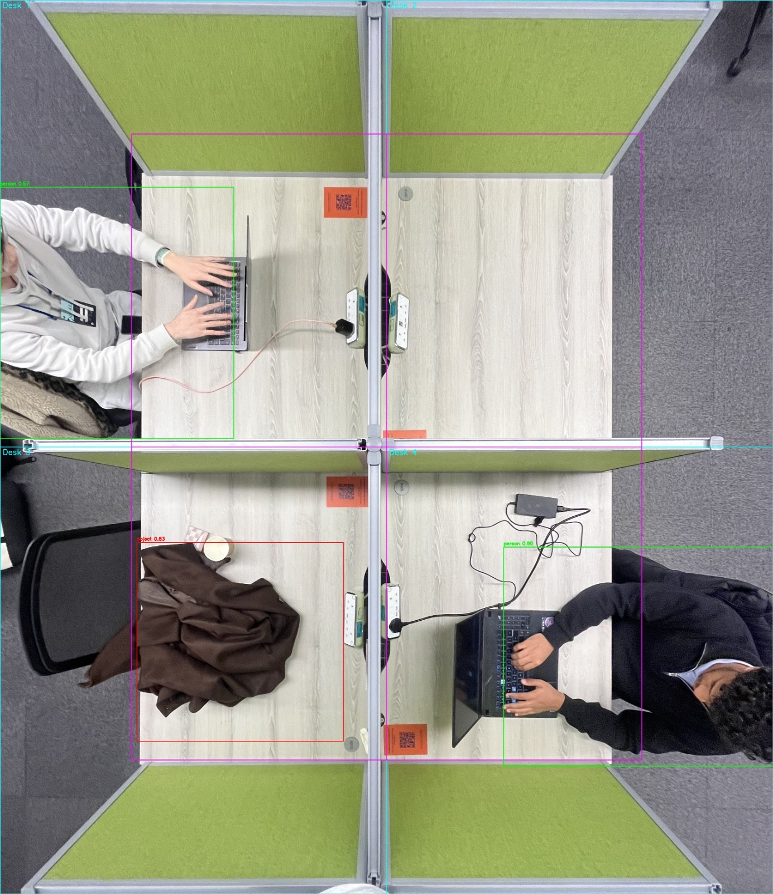
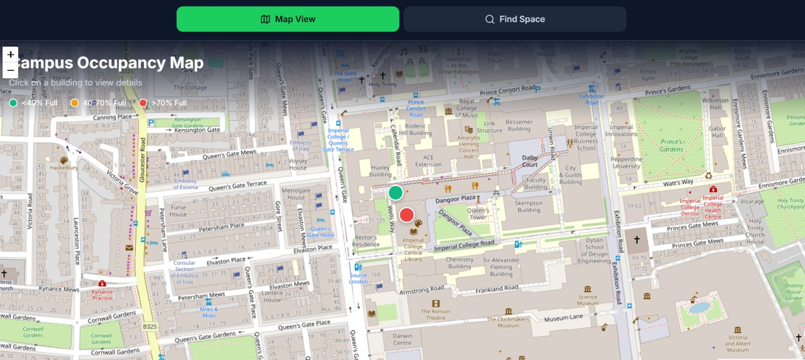
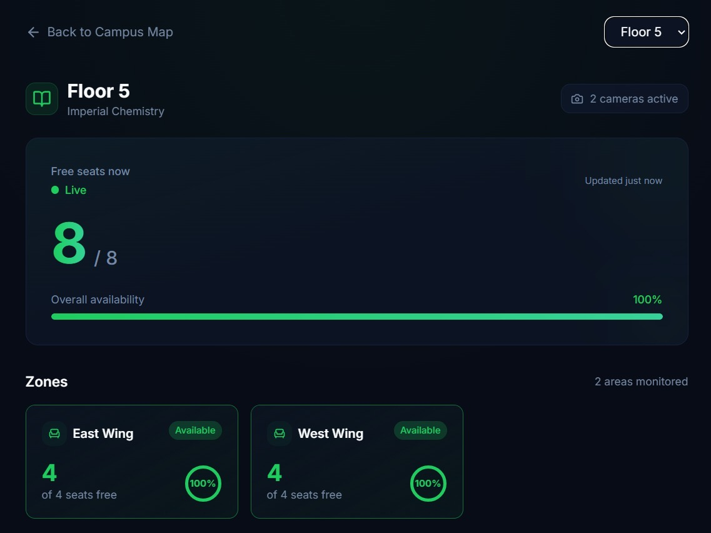
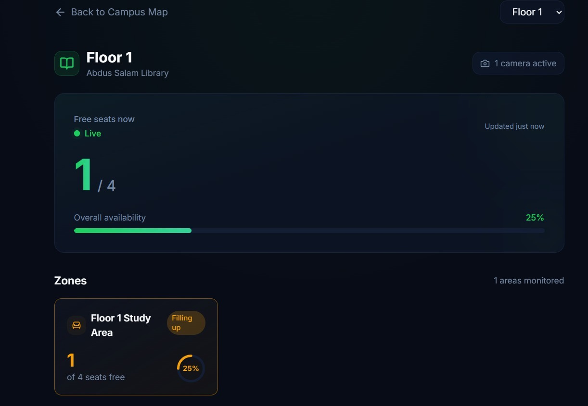
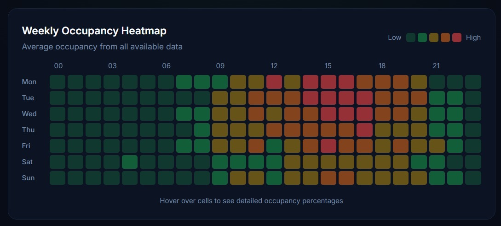

# LibSpace: real-time library occupancy

Find a free seat without trekking floor to floor. LibSpace uses overhead cameras
and computer vision to count free seats in a university library in real time,
then surfaces live availability on a campus map, per-floor breakdowns, and weekly
patterns.

Built at **IC Hack 2026**.

## How it works
LibSpace runs object detection on overhead camera frames to decide which desks
are occupied, aggregates the results per zone and floor, and serves them to a
live dashboard.

### 1. Detection
A Faster R-CNN (Inception v2, COCO) model detects people and personal items at
each desk. A laptop or bag left behind still counts the desk as taken, even when
the person has stepped away.

### 2. Campus map
Buildings are colour-coded by how full they are, so you can pick where to head at
a glance.

### 3. Live floor view
Drill into a building to see free seats per floor and per zone, updated live. The
status shifts from available to filling up to full as seats are taken.

### 4. Weekly patterns
A weekly heatmap shows when the library is usually quiet or busy, from all
collected data.

## Stack
- **Computer vision / backend:** Python, OpenCV, TensorFlow (Faster R-CNN
  Inception v2), SQL
- **Frontend:** Vite + React + TypeScript + shadcn/ui (Tailwind)

## Layout
- `backend/`: detection, occupancy generation, database, API
- `frontend/`: the live dashboard

> Hackathon project, built over the IC Hack 2026 weekend.
